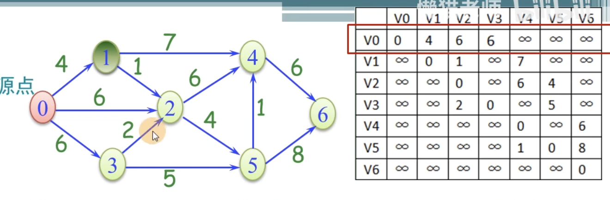

==========================================
最短路径
==========================================

参考
`最短路径文章 <https://nullcode.fun/132.html>`_ 

基本结构和思想

- dist[n] 表示起始点startN 到 具体第N个点的距离。 
- path[n] 表示当前点位到达的上一个点位的索引。 比如 最短路径 1 3 4 这样走， 那path[4]=3 。 
- s[n] 表示当前点在S里面还是在U里面的， 通过s[i]==1 表示在S， s[i]]=0 表示在U里面。
- startN 表示我起点的位置索引。 

思想

.. code-block:: text 

    1. 初始化 dist path s ; 
    2. while ( s元素个数<n)
       2.1 在dist[n] 中找到最小值， 下标为k .
       2.2 修改数组dist path 
       2.3 将k点位加入到S  ; 

样例图

堆顺序存储实现
==========================================

.. literalinclude:: ../code/sssp.c
   :encoding: utf-8
   :language: c
   :linenos:

